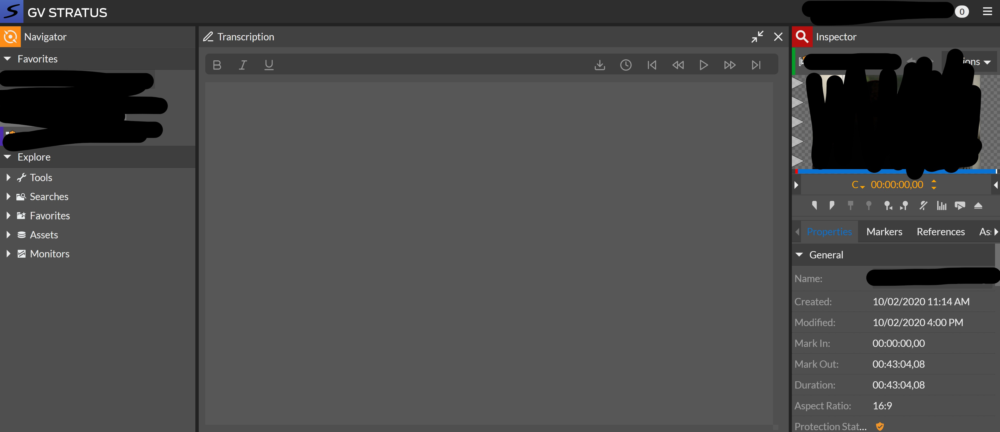

# StratusLogger

A Chrome extension that adds an integrated transcription feature to the Grass Valley STRATUS News Video Production & Content Management System, with interactive timestamps and keyboard shortcuts designed to make the logging process faster.

